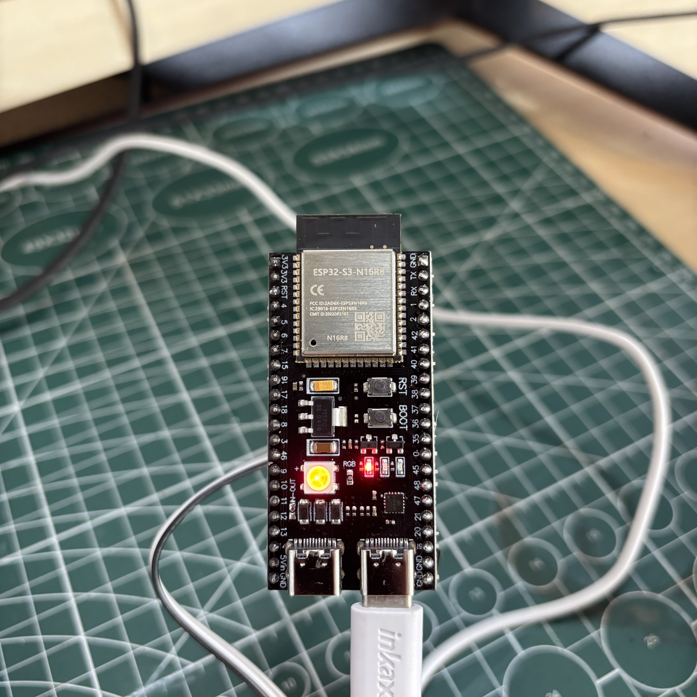
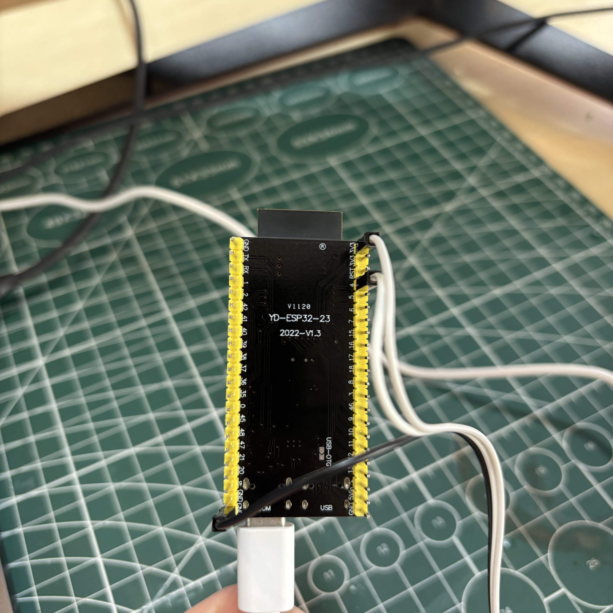
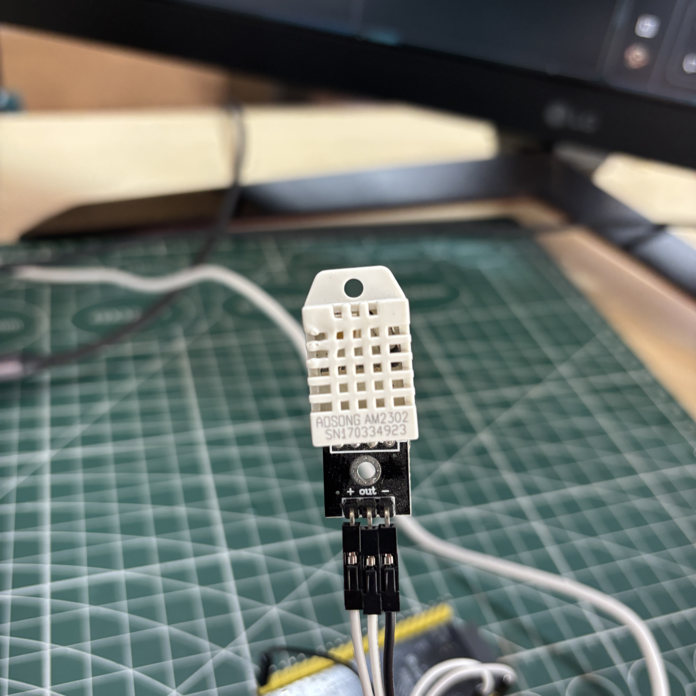
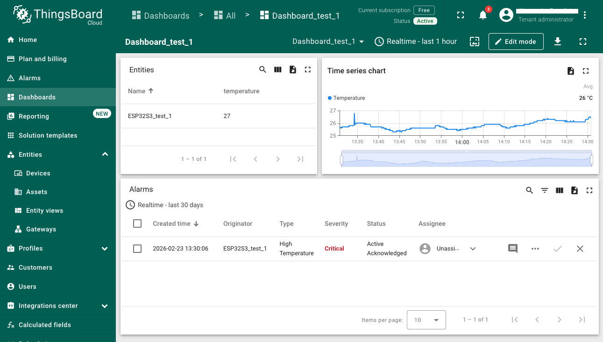

# ESP32-S3 AM2302 MQTT Monitor


IoT project that reads **temperature and humidity** from an **AOSONG AM2302 (DHT22)** sensor and publish the data to **ThingsBoard Cloud** via **MQTT** using an **ESP32-S3-N16R8** development board. The board's RGB LED changes colour based on the reading temperature.

---

## Table of Contents

- [Overview](#overview)
- [Hardware Requirements](#hardware-requirements)
- [Wiring Diagram](#wiring-diagram)
- [Software Requirements](#software-requirements)
- [Project Structure](#project-structure)
- [Setup Guide](#setup-guide)
- [RGB LED Behaviour](#rgb-led-behaviour)
- [ThingsBoard Dashboard](#thingsboard-dashboard)
- [Troubleshooting](#troubleshooting)
- [Troubleshooting](#troubleshooting)


---

## Overview

This project demonstrates a complete IoT pipeline:

```
AM2302 Sensor
      │
      ▼
ESP32-S3-N16R8
  │         │
  │         └──► Onboard RGB LED  (colour reflects temperature)
  │
  ▼ WiFi / MQTT
ThingsBoard Cloud
  └──► Live Telemetry Dashboard
```

**Data is sent every 5 seconds** to ThingsBoard Cloud where it can be visualised on a live dashboard.

---

## Hardware Requirements

| Component | Details |
|---|---|
| **MCU Board** | ESP32-S3-N16R8 (16MB Flash, 8MB OPI PSRAM) |
| **Sensor** | AOSONG AM2302 (DHT22) Temperature & Humidity |
| **LED** | Embedded WS2812B RGB LED (GPIO 48) |
| **Cable** | USB data cable |
| **Jumper wires** | 3x FM or FF |

---

## Wiring Diagram

```
AM2302          ESP32-S3-N16R8
  +     ───────  3V3
  out   ───────  GPIO 4
  -     ───────  GND
```

> Use the **3V3 pin** — DO NOT connect to 5V on the ESP32-S3.

| AM2302 Pin | Wire Colour | ESP32-S3 Pin |
|---|---|---|
| `+` (VCC) | Red | `3V3` |
| `out` (Data) | Yellow | `GPIO 4` |
| `-` (GND) | Black | `GND` |

---

## Software Requirements

| Tool | Details |
|---|---|
| [VS Code](https://code.visualstudio.com) | Code editor |
| [PlatformIO IDE](https://platformio.org) | VS Code extension |
| [ThingsBoard Cloud](https://thingsboard.cloud) | Free IoT dashboard |

### Libraries (auto-installed via `platformio.ini`)
- `adafruit/DHT sensor library`
- `adafruit/Adafruit NeoPixel`
- `knolleary/PubSubClient`

---

## Project Structure

```
esp32s3-am2302-mqtt/
├── src/
│   └── main.cpp           # Main application code
├── platformio.ini         # PlatformIO board & library config
├── .gitignore             # Git ignored files
└── README.md              # This file
```

---

## Setup Guide

### 1) Clone the repository
```bash
git clone https://github.com/alessandro-001/esp32s3-am2302-mqtt.git
cd esp32s3-am2302-mqtt
```

### 2) Open in VS Code
```bash
code .
```

### 3) Configure your credentials
Open `src/main.cpp` and replace the placeholders:

```cpp
#define WIFI_SSID     "YOUR_WIFI_SSID_HERE"
#define WIFI_PASSWORD "YOUR_WIFI_PASSWORD_HERE"
#define TB_TOKEN      "YOUR_THINGSBOARD_TOKEN_HERE"
```

### 4) Get your ThingsBoard token
1. Log in to [thingsboard.cloud](https://thingsboard.cloud)
2. Go to **Devices** → your device
3. Click **"Copy Access Token"**
4. Paste it as the value of `TB_TOKEN`

### 5) Build and Upload
In VS Code PlatformIO toolbar at the bottom:
1. Click  **Build** — compiles the code
2. Click  **Upload** — flashes the board
3. Click  **Serial Monitor** — view live output

> If upload fails: hold **BOOT** > press **RESET** > release **BOOT** > click Upload

### 6) Expected Serial Monitor output
```
Connecting to WiFi: YourNetwork
WiFi connected! IP: 192.168.x.x
Connecting to ThingsBoard... Connected!
Ready — sending sensor data to ThingsBoard!
Sent: {"temperature":25.5,"humidity":60.7}
```

### 7) Setting Up Alarms on ThigsBoard Cloud

ThingsBoard lets you create alarms to get notified when temperature or humidity goes outside your desired range.

To configure alarms and start monitoring your sensor data:

1. Log in to [thingsboard.cloud](https://thingsboard.cloud)
2. Follow the [ThingsBoard Getting Started Guide](https://thingsboard.io/docs/getting-started-guides/helloworld/)
3. Use the `temperature` and `humidity` telemetry keys from your device to set up alarm rules

Once configured, you can receive notifications when readings exceed your thresholds.

---

## RGB LED Behaviour

The onboard WS2812B RGB LED (GPIO 48) reflects the current temperature, temperatures can be mofified for your liking:

| Colour | Temperature | Meaning |
|---|---|---|
| 🟠 Orange | On startup | Connecting to WiFi |
| 🔵 Blue | Below 18°C | Cold |
| 🟢 Green | 18°C – 26°C | Comfortable |
| 🔴 Red | Above 26°C | Hot |

Brightness is currently set to `10/255`

---

## ThingsBoard Dashboard

1. Log in to [thingsboard.cloud](https://thingsboard.cloud)
2. Go to **Devices** > your device > **Latest Telemetry**
3. You will see `temperature` and `humidity` updating every 5 seconds

To create a live graph:
1. Go to **Dashboards** → **Create new dashboard**
2. Add a **Time Series Chart** widget
3. Select your device and `temperature` / `humidity` keys

---

## Troubleshooting

| Problem | Cause | Fix |
|---|---|---|
| Dots keep printing in Serial Monitor | Wrong WiFi credentials | Check SSID (case sensitive) and password |
| ESP32 won't connect to WiFi | 5GHz network | ESP32-S3 supports **2.4GHz only** |
| Upload fails — port not found | Board not in boot mode | Hold BOOT + press RESET + release BOOT |
| `Failed to read from AM2302` | Wrong wiring | Check `+` > 3V3, `out` > GPIO4, `-` > GND |
| No port shown in IDE | Missing USB driver or charge-only cable | Install [CP210x driver](https://www.silabs.com/developers/usb-to-uart-bridge-vcp-drivers) / use data cable |
| ThingsBoard not receiving data | Wrong token | Re-copy token from ThingsBoard device page |
| Garbage in Serial Monitor | Wrong baud rate | Set Serial Monitor to **115200** |

---

 ESP32-S3 Board
 AM2302 Wiring
 DHT22
 ThingsBoard dashboard


## License

MIT License — feel free to use and modify for your own projects ;)
